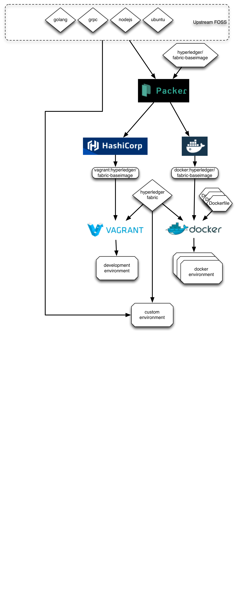

# Baseimage Introduction
This directory contains the infrastructure for creating a new baseimage used as the basis for various docker images consumed within the Hyperledger Fabric workflow such as chaincode compilation/execution, unit-testing, and even cluster simulation. It is based on ubuntu-16.04 with various opensource projects added such as golang, grpc, and node.js. The actual Hyperledger code is injected just-in-time before deployment.  The resulting images are published to various dockerhub repositories such as [hub.docker.com](https://hub.docker.com/r/hyperledger/fabric-baseimage/).

The purpose of this baseimage is to act as a bridge between a raw ubuntu/xenial configuration and the customizations required for supporting a Hyperledger Fabric environment.  Some of the FOSS components that need to be added to Ubuntu do not have convenient native packages.  Therefore, they are built from source.  However, the build process is generally expensive (often taking in excess of 30 minutes) so it is fairly inefficient to JIT assemble these components on demand.

Therefore, the expensive FOSS components are built into this baseimage once and subsequently cached on the public repositories so that workflows may simply consume the objects without requiring a local build cycle.

# Intended Audience
This is only intended for release managers curating the base images on docker-hub.  Typical developers may safely ignore this directory completely.

Anyone wishing to customize their image is encouraged to do so via downstream means, such as a custom Dockerfile.

## Exceptions

If a component is found to be both broadly applicable and expensive to build JIT, it may be a candidate for inclusion in a future baseimage.

# Usage

* "make docker" will build the docker images and commit it to your local environment; e.g. "hyperledger/fabric-baseimage". The docker image is also tagged with architecture and release details.
* "make install" build build the docker images and push them to dockerhub.

 This work is licensed under a <a rel="license" href="http://creativecommons.org/licenses/by/4.0/">Creative Commons Attribution 4.0 International License</a>.
s
